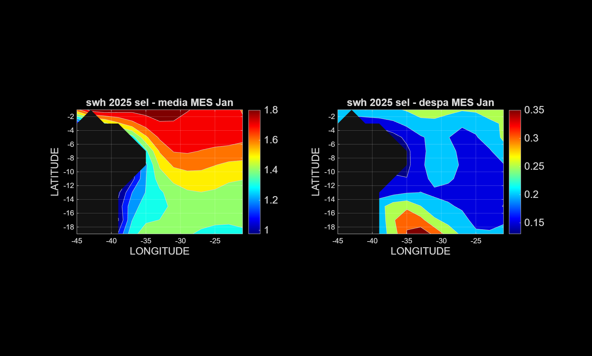
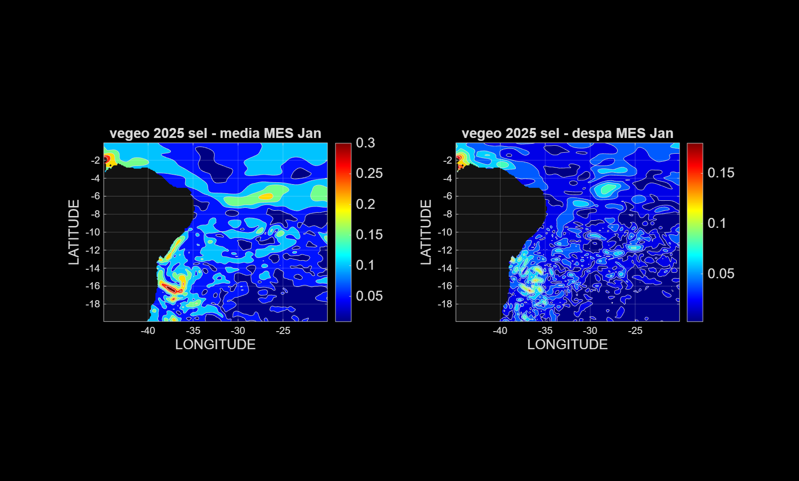
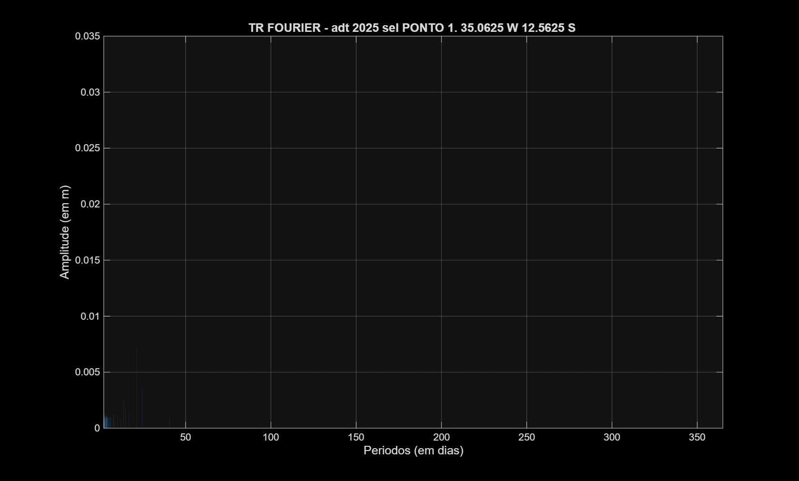
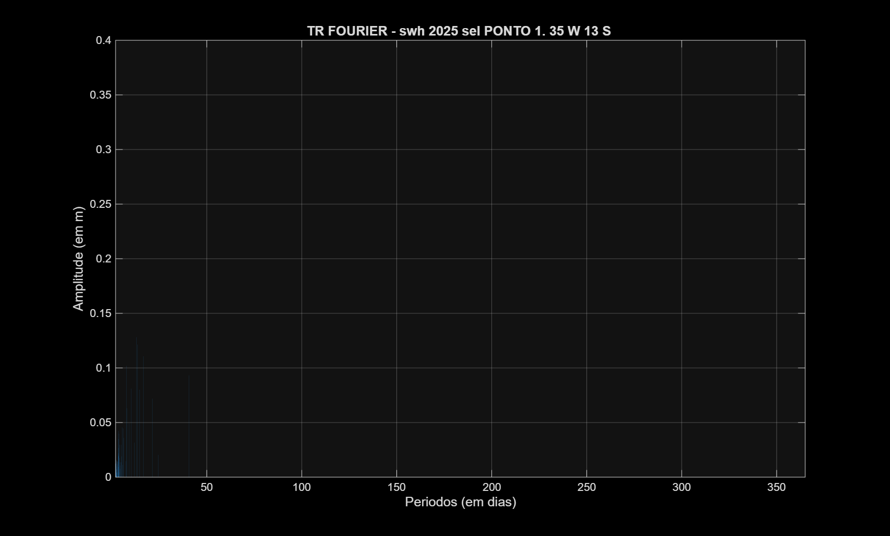
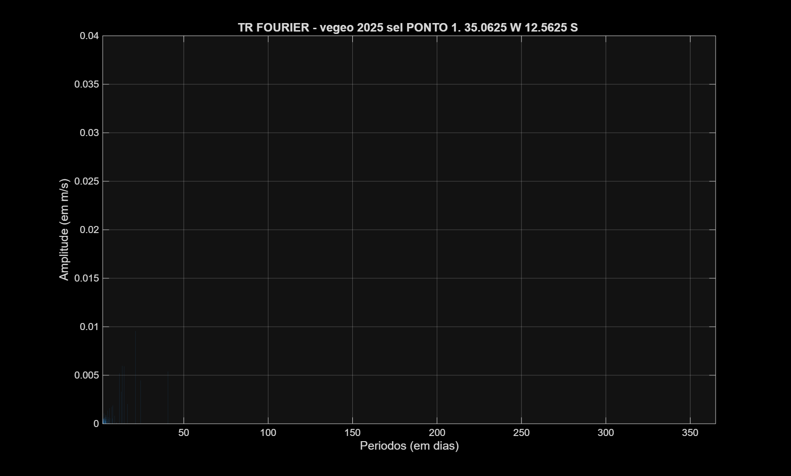

# Analise dos Graficos

Este arquivo complementa o [README.md](README.md) com uma leitura das figuras geradas pelo script [altim_L1_adriano_caversan.m](altim_L1_adriano_caversan.m) e discutidas no relatorio [altim_L1_adriano_caversan.pdf](altim_L1_adriano_caversan.pdf).

As imagens abaixo sao **representativas** do conjunto total. Todas as saidas permanecem disponiveis em `plots/`.

## 1. Mapas mensais

### 1.1 ADT

Janeiro:

Julho:

Leitura:

- O campo medio de ADT mostra um gradiente persistente entre a costa e o oceano aberto.
- Os maiores valores aparecem no setor oeste e sudoeste do dominio, com valores menores a leste.
- Em julho, o contraste espacial fica ainda mais claro, com nucleo costeiro mais elevado e faixa oceanica mais baixa.
- O desvio padrao e maior perto da costa e em regioes de transicao, enquanto o oceano aberto tende a ser mais estavel.

### 1.2 SWH

Janeiro:

Julho:

Leitura:

- O SWH aparece em uma grade mais grosseira, mas ainda revela um padrao espacial coerente.
- Em janeiro, as alturas significativas de onda ficam em torno de `1.0` a `1.8 m`, com valores menores perto da costa.
- Em julho, o setor oceanico central e leste mostra ondas mais altas, chegando perto de `2.0 m`.
- O desvio padrao aumenta nas areas de maior energia de onda, sugerindo maior variabilidade temporal nessas porcoes do dominio.

### 1.3 VEGEO

Janeiro:

Julho:

Leitura:

- O VEGEO foi calculado como modulo da velocidade geostrofica a partir de `ugosa` e `vgosa`.
- As correntes mais intensas aparecem junto a costa e em faixas dinamicas do dominio.
- Em julho, destaca-se uma banda de velocidades elevadas na porcao norte do recorte, alem de maxima costeira no sudoeste.
- O desvio padrao acompanha essas mesmas regioes, indicando que os setores mais energeticos tambem sao os mais variaveis.

## 2. Analise em ponto fixo

Ponto nominal escolhido: `(-35.0, -12.5)`.

- Para **ADT** e **VEGEO**, o ponto de grade usado pelo script fica em `35.0625 W, 12.5625 S`.
- Para **SWH**, devido a resolucao mais grossa do produto, o ponto usado fica em `35 W, 13 S`.

Resumo estatistico informado no relatorio:

- **ADT:** media `0.617 m`, desvio padrao `0.029 m`
- **SWH:** media `1.776 m`, desvio padrao `0.466 m`
- **VEGEO:** media `0.086 m/s`, desvio padrao `0.050 m/s`

### 2.1 ADT no ponto

Serie temporal:

Espectro:

Arquivos complementares:

- `plots/adt_2025_sel_pto_1_fig_2.png` - histograma

Leitura:

- A serie de ADT oscila em torno de `0.60-0.66 m`, com variabilidade moderada ao longo do ano.
- A reta de tendencia indica leve declinio medio no periodo analisado.
- Ha um pico isolado por volta do dia `255`, o que sugere um evento transitorio ou uma anomalia local na serie.
- O espectro concentra energia em baixas frequencias e sustenta a interpretacao do relatorio de que ha componentes sazonais relevantes.

### 2.2 SWH no ponto

Serie temporal:

Espectro:

Arquivos complementares:

- `plots/swh_2025_sel_pto_1_fig_2.png` - histograma

Leitura:

- O SWH e a variavel mais energica no ponto, com oscilacoes frequentes entre aproximadamente `1.0` e `3.6 m`.
- A tendencia linear e fracamente positiva, mas a variabilidade de alta frequencia domina visualmente a serie.
- Os picos mais fortes se concentram entre o meio e o fim do ano.
- No espectro, a maior parte da energia aparece em periodos curtos a submensais, em linha com a interpretacao do relatorio para forcantes meteorologicas.

### 2.3 VEGEO no ponto

Serie temporal:

Espectro:

Arquivos complementares:

- `plots/vegeo_2025_sel_pto_1_fig_2.png` - histograma

Leitura:

- O VEGEO apresenta pulsos episodicos bem marcados, com maxima perto de `0.24 m/s`.
- A tendencia linear e ligeiramente positiva, embora as oscilacoes intrassazonais sejam mais fortes que a tendencia.
- O periodo entre aproximadamente os dias `235` e `285` concentra os maiores eventos da serie.
- O espectro tambem mostra predominio de energia em periodos mais curtos, com modulacao em escalas mais longas descrita no relatorio.

## 3. Diagrama longitude x tempo x ADT

Leitura:

- O diagrama foi construido para a secao zonal em latitude aproximada de `-12.56`.
- A ADT permanece mais elevada na porcao oeste do dominio, isto e, mais proxima da costa.
- Em direcao ao oceano aberto, o campo tende a diminuir e a se tornar mais homogeneo.
- O padrao ao longo do tempo sugere modulacao sazonal e persistencia do contraste costa-oceano.

## 4. Observacoes metodologicas

- O script calcula medias e desvios padrao mensais diretamente a partir dos cubos `x-y-tempo`.
- O SWH e analisado em sua grade nativa e, no ponto, falhas eventuais sao preenchidas por interpolacao linear temporal.
- A FFT e aplicada apos remocao da media de cada serie.
- Como os graficos espectrais mostram todo o intervalo de periodos no eixo `x`, os picos de periodos longos ficam menos visiveis visualmente, mesmo quando sao destacados no relatorio.
