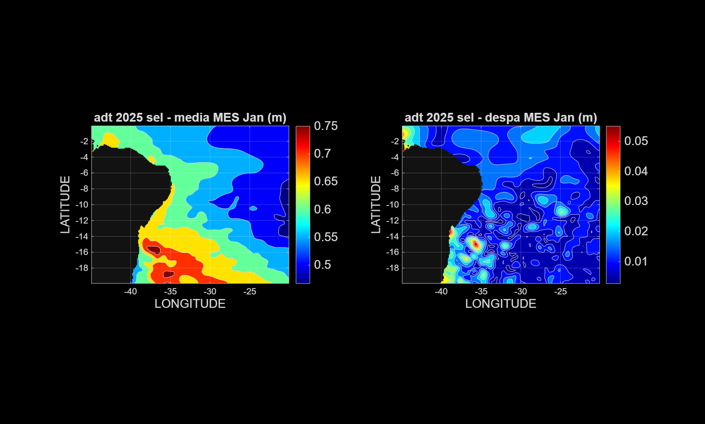
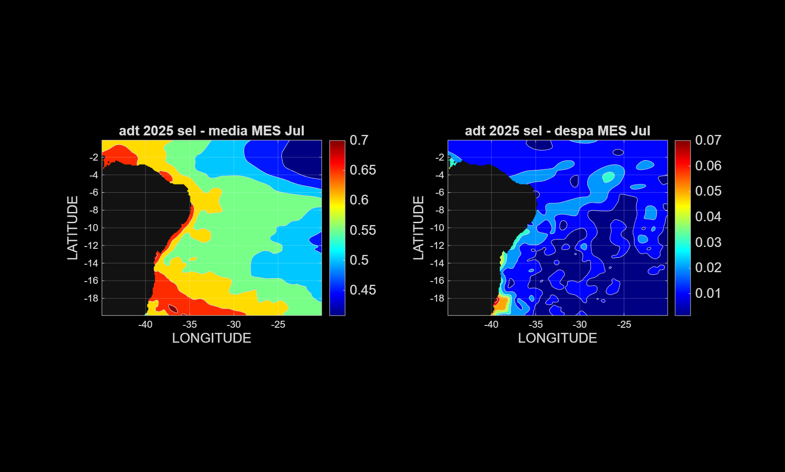
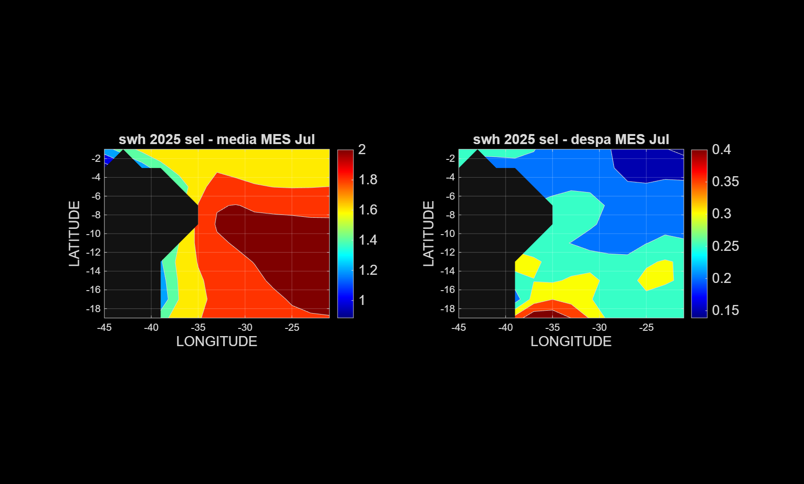
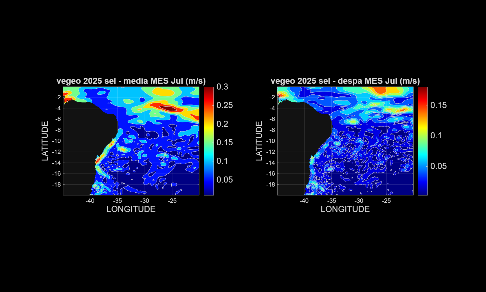
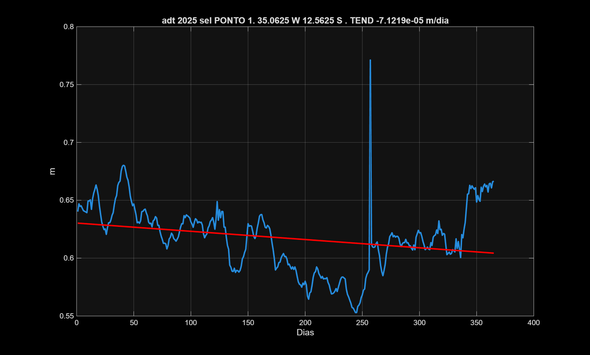
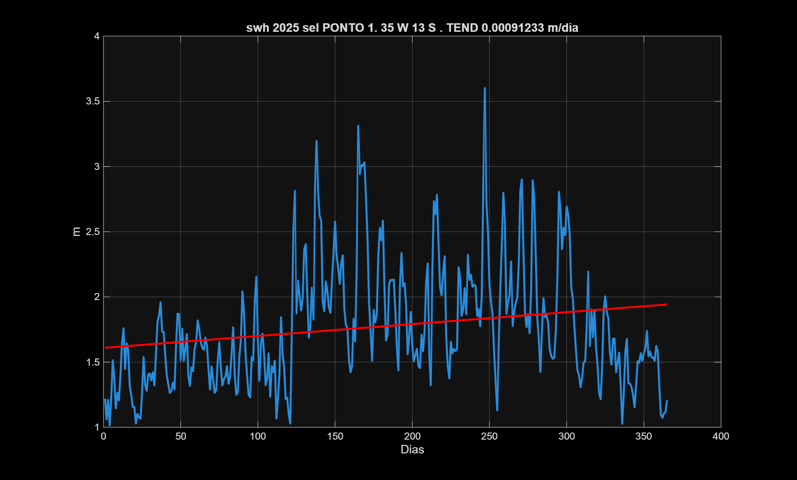
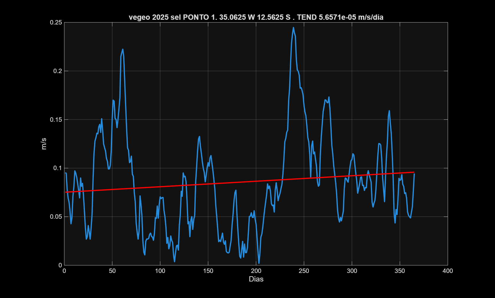
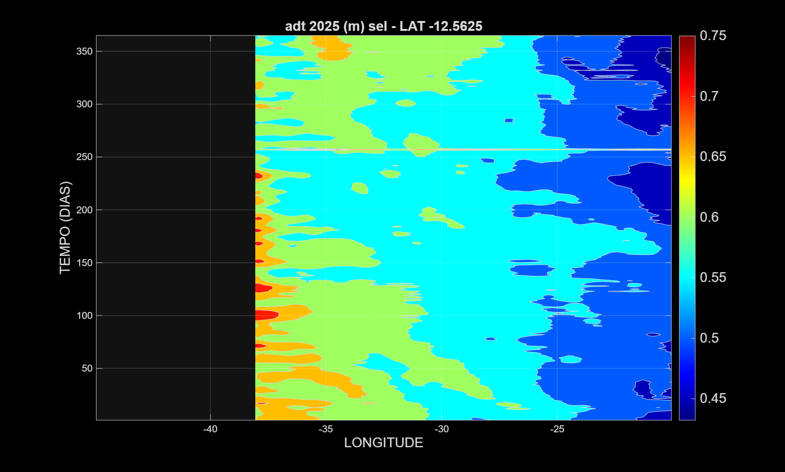

# Respostas - Lista 1

Respostas curtas e objetivas para os itens da lista `exerc_01_altim_2026.pdf`, com base no script `altim_L1_adriano_caversan.m`, no relatorio final e nos graficos gerados.

## 1. Escolha da area oceanica

Foi escolhida uma area no **Atlantico Sul**, ao longo da **costa brasileira**, incluindo parte do oceano e parte continental para referencia.

- Latitude aproximada: `-20` a `0`
- Longitude aproximada: `-45` a `-20`

Essa regiao foi escolhida por ser uma area costeira importante, com variacao espacial visivel nos dados e boa utilidade para comparar costa e oceano aberto.

Figura ilustrativa do dominio:

## 2. Selecao dos dados gradeados diarios

Foram utilizados dados diarios multi-satelite do ano de **2025** para tres variaveis:

- **ADT**: topografia dinamica absoluta
- **SWH**: altura significativa de onda
- **VEGEO**: velocidade geostrofica

Os dados de ADT e SWH foram lidos de arquivos NetCDF do CMEMS. O VEGEO foi obtido a partir das componentes `ugosa` e `vgosa`, calculando o modulo da velocidade.

De forma simples, isso significa que o trabalho usou:

- um campo de nivel do mar
- um campo de altura de onda
- um campo de velocidade das correntes

## 3. Mapas mensais de media e desvio padrao

Foram gerados mapas mensais de **media** e **desvio padrao** para ADT, SWH e VEGEO ao longo de 2025.

Em termos gerais, os mapas mostram:

- **ADT**: valores mais altos perto da costa e menores em direcao ao oceano aberto
- **SWH**: ondas menores perto da costa e maiores em partes mais abertas do oceano
- **VEGEO**: correntes mais intensas em algumas faixas costeiras e em areas mais dinamicas

Esses resultados mostram que existe variacao espacial e tambem mudanca ao longo dos meses, mesmo sem entrar em interpretacoes mais avancadas.

### Exemplo de ADT

### Exemplo de SWH

### Exemplo de VEGEO

## 4. Serie temporal diaria em um ponto do dominio

Foi escolhido um ponto proximo de:

- Longitude: `-35.0`
- Latitude: `-12.5`

Nesse ponto, foram analisadas as series temporais diarias de ADT, SWH e VEGEO por metodos estatisticos e espectrais.

Resumo simples:

- **ADT**: variacao pequena ao longo do ano
- **SWH**: variacao maior, com varios picos
- **VEGEO**: variacao moderada, com alguns eventos mais fortes

Tambem foram feitos:

- graficos de serie temporal
- histogramas
- espectros por FFT

Isso ajuda a ver tanto o comportamento medio quanto as oscilacoes mais importantes das variaveis no ponto escolhido.

### Exemplo de serie temporal de ADT

### Exemplo de serie temporal de SWH

### Exemplo de serie temporal de VEGEO

## 5. Diagrama longitude x tempo x ADT

Foi construido um diagrama **longitude x tempo x ADT** para uma secao zonal na latitude aproximada de `-12.5`.

De forma simples, o grafico mostra que:

- os maiores valores de ADT tendem a aparecer mais perto da costa
- em direcao ao oceano aberto, os valores ficam menores
- ao longo do ano existe variacao temporal, indicando mudancas sazonais no campo

Esse diagrama e util porque junta espaco e tempo em uma unica figura, facilitando a visualizacao das mudancas ao longo da secao escolhida.

## Conclusao

O exercicio permitiu praticar a leitura, o processamento e a interpretacao inicial de dados gradeados de altimetria e ondas. Mesmo em um nivel introdutorio, ja foi possivel observar diferencas entre costa e oceano aberto, mudancas mensais e variabilidade temporal em um ponto do dominio.
